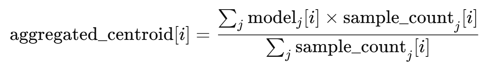

# Federated Learning for ECG Anomaly Detection with Blockchain Integration

## Overview

This project presents a secure, privacy-preserving system that integrates Federated Learning (FL) with blockchain technology for real-time ECG anomaly detection. The system leverages decentralized edge nodes that train a local model using patient-specific ECG data. These local updates are then aggregated via a weighted FedAvg algorithm—which incorporates the number of samples used at each node—to update a global model. Blockchain is used to securely store model parameters and sample counts, creating an immutable audit trail and ensuring robust data security without centralizing sensitive data.

## System Architecture

The system comprises three main components:

1. **Initial Training and Blockchain Update Module**  
   - **Data Preprocessing:** The system preprocesses a raw ECG dataset by resampling and scaling each signal to a fixed length (80 samples), ensuring a uniform input size.  
   - **DTW-Based Clustering:** A DTW-based k-means clustering algorithm partitions the training data into three clusters. For each cluster, the centroid (average signal) is computed using a DTW-averaging function that aligns signals and averages them.  
   - **Visualization and Evaluation:** Cluster centroids, purity scores, and prediction performance (accuracy and confusion matrix) are visualized and reported.  
   - **Blockchain Update:** The computed centroids are flattened and scaled (using a scaling factor, e.g., 1e6) to convert floating-point values into integers. Sample counts for each cluster (derived from the training data) are also computed. Both the scaled model and sample counts are sent to a blockchain smart contract by calling its `updateGlobalModel` function.

2. **Edge Node Update Module**  
   - **Model Retrieval:** Each edge node retrieves the current global model and sample counts from the global model contract. The flat model vector is then reshaped into a (3×80) matrix.
   - **Local Training on Actual Data:** Instead of using dummy updates, each edge node uses its own actual ECG data (from files specific to that node) to further train the model. For each cluster, the node computes DTW distances between the cluster centroid and its local samples, selects the best matching samples, and recalculates the centroid using a DTW-based averaging function. This process also computes the updated sample counts (the true number of samples used per cluster).  
   - **Evaluation:** The updated model is tested on five randomly selected new samples from the node’s dataset, with predicted labels printed alongside the true labels.  
   - **Blockchain Update:** The refined model (flattened and scaled) and the actual sample counts are pushed from the node’s dedicated blockchain account to update its stored model.

3. **Global Aggregation (FedAvg) Module**  
   - **Model Collection:** An aggregator script retrieves updated models and sample counts from the blockchain accounts of each edge node.  
   - **Weighted FedAvg Aggregation:** A weighted Federated Averaging algorithm is applied for each cluster. For each cluster *i*, the aggregated centroid is computed as:

    

     This ensures that nodes providing more data have a larger influence on the final global model.
   - **Global Model Update:** The aggregated global model (flattened and scaled back to integer values) along with the aggregated sample counts is then pushed to a public aggregator contract. This aggregated model becomes the new reference for all nodes in the next training cycle.

## Environment Setup

### Ganache and Configuration

- **Ganache:**  
  A personal Ethereum blockchain simulator running at `http://127.0.0.1:7545` is used for development and testing. Several accounts are automatically generated with test Ether.
  
- **Configuration File (`config.ini`):**  
  This file holds the Ganache URL, contract addresses for the global model and individual edge nodes, and the corresponding private keys for signing transactions. All necessary configuration details (including the ABI) are specified here.

### Smart Contract

The Solidity smart contract, `GlobalModelStorage.sol`, is deployed on Ganache and is responsible for:
- **Storing the Global Model:**  
  The contract stores the global model parameters as a flat integer array (240 parameters for 3 clusters × 80 samples per centroid).
- **Maintaining Sample Counts:**  
  An array (length 3) holds the sample counts for each cluster.
- **Key Functions:**  
  - **constructor(modelSize, sampleSize):** Initializes the `globalWeights` and `sampleCounts` arrays.
  - **updateGlobalModel(newModel, newSampleCounts):** Updates the stored model and sample counts.
  - **getGlobalModel():** Returns the current global model and sample counts.

## Module Descriptions

### Initial Training and Blockchain Update Module

- **Data Preprocessing:**  
  ECG data is loaded from a CSV file, resampled, and scaled to a fixed length (80 samples) using adaptive scaling.
  
- **DTW-Based Clustering:**  
  A DTW-based k-means clustering algorithm partitions the processed data into 3 clusters. The centroids for each cluster are computed via DTW averaging, which aligns the time series data and calculates the average signal, thus accounting for non-linear time distortions in ECG readings.
  
- **Visualization and Evaluation:**  
  The system visualizes cluster centroids along with purity scores. A held-out test set is used to assess performance via DTW-based prediction, and the overall accuracy and confusion matrix are displayed.
  
- **Blockchain Update:**  
  The final centroids (average signals) are flattened and scaled. The training script also computes sample counts (the number of samples used per cluster) based on the training dataset. Both the scaled model and the sample counts are then pushed to the blockchain using the smart contract’s `updateGlobalModel` function.

### Edge Node Update Module

- **Model Retrieval:**  
  Each edge node connects to Ganache, retrieves the current global model and sample counts from the global model contract, and reshapes the flat vector into a (3×80) matrix.
  
- **Local Data Training:**  
  Edge nodes use actual ECG data from their endpoints (each node uses its own CSV file) to further train the global model. For each cluster, DTW distances are calculated between the current centroid and the local samples; the best-matching samples are selected, and the centroid is updated using DTW averaging. The process also updates the sample counts based on the actual number of samples used per cluster.
  
- **Model Testing:**  
  The updated model is evaluated on 5 random samples from the new local dataset. Predictions along with a comparison to ground truth are printed.
  
- **Blockchain Update:**  
  The updated model (flattened and scaled) along with the actual sample counts is pushed back to the blockchain from the node’s dedicated account. This ensures that each edge node’s update is preserved separately.

### Aggregator (FedAvg) Module

- **Model Collection:**  
  The aggregator script (fedavg.py) connects to Ganache and retrieves the updated models and sample counts from the blockchain accounts of all edge nodes.
  
- **Weighted FedAvg Aggregation:**  
  A weighted Federated Averaging algorithm is applied to compute an aggregated global model. Each cluster's centroid in the final model is calculated as a weighted average of the centroids from each edge node, with weights determined by the sample counts from each node.
  
- **Global Model Update:**  
  The final aggregated model (flattened and scaled) along with the aggregated sample counts is pushed back to a global aggregator contract, making it the new global reference for all nodes in the next update cycle.

## Integrated System Workflow

1. **Initialization (Training and Blockchain Update):**  
   - The initial training script processes the ECG data, computes the initial global model (centroids), and uploads the model (flattened and scaled) along with sample counts to the blockchain.

2. **Local Edge Node Updates:**  
   - Each edge node retrieves the global model from the blockchain, further refines it with its own actual data (updating centroids and sample counts), and then pushes its updated model back to its dedicated blockchain account.

3. **Global Aggregation (FedAvg):**  
   - The aggregator retrieves the updated models and sample counts from all edge nodes, applies a weighted FedAvg algorithm to generate an aggregated global model, and then updates the public aggregator contract.

4. **Continuous Update Cycle:**  
   - The process iterates with edge nodes continually updating the global model based on new local data, and the aggregator periodically recombining these updates to form a robust, continuously improving global model.

## How to Run

1. **Configuration:**  
   - Update `config.ini` with your Ganache URL, contract addresses (global model and individual edge nodes), and corresponding private keys.
   - Ensure the smart contract is deployed on Ganache using Remix IDE and note the contract addresses.

2. **Initial Training:**  
   - Run `training_and_blockchain.py` to preprocess ECG data, compute the initial global model, and push it (with sample counts) to the blockchain.

3. **Edge Node Update:**  
   - Run `edge_node_update.py` on each edge node (pass the account number as a command-line argument) to refine the model using local data and update each node’s dedicated blockchain account.

4. **Aggregation:**  
   - Run `fedavg.py` to retrieve all updated models and sample counts from edge nodes, aggregate them using weighted FedAvg, and push the final aggregated model (and aggregated counts) to the global model contract.

## Dependencies

- Python 3.x
- NumPy
- Pandas
- Matplotlib
- Web3.py
- ConfigParser (standard in Python 3.x)
- Ganache (local Ethereum blockchain simulator)
- Remix IDE (for smart contract development)

## Future Work

- **Real-World Deployment:** Test the system in a live environment with actual IoT devices.
- **Enhanced Aggregation Techniques:** Refine the FedAvg algorithm to dynamically adjust weights based on model performance and sample quality.
- **Dashboard Development:** Create a real-time dashboard for monitoring blockchain transactions and model update statuses.
- **Fault Tolerance:** Implement mechanisms to handle delayed or missing updates from edge nodes.

## Conclusion

This project demonstrates a decentralized, secure system that combines federated learning with blockchain technology to achieve ECG anomaly detection while preserving user privacy. By integrating DTW-based clustering, actual local data training at edge nodes, and a weighted FedAvg aggregation approach, the system continuously improves its global model through iterative updates. Blockchain integration ensures that all updates are transparently recorded and secured, enabling a robust and reliable distributed training environment.

For any questions, issues, or contributions, please submit an issue or pull request on GitHub.

